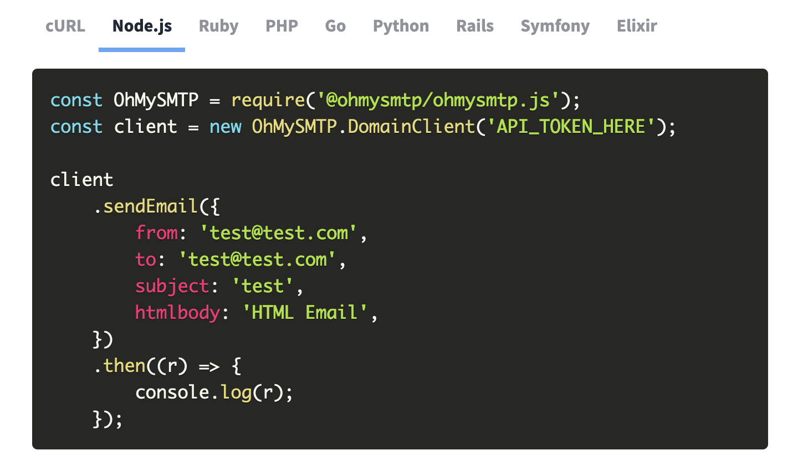

When demonstrating code, it really helps to be able to show the examples with syntax highlighting, and this is exactly what we do for our landing page over at https://mailpace.com, which looks like this:



With the the help of [PrismJS](https://prismjs.com/) this is actually really, really easy.

## Dependencies

There are a couple of choices here. If you're already using a JavaScript Bundler like esbuild, rollup.js, or Webpack or you can use the [Prism.js Babel Plugin](https://github.com/mAAdhaTTah/babel-plugin-prismjs).

Or if you're just doing this in hand-rolled HTML site you can simply visit https://prismjs.com/, choose the languages you need, pick a theme, download the `prism.js` and `prism.css` files, and include them in your HTML:

```html
<head>
  ...
  <link rel="stylesheet" href="prism.css" />
</head>
<body>
  ...
  <script src="prism.js"></script>
</body>
```

## Laying out the code

Once you have your `prism.js` and `prism.css` code included or bundled into the browser, you just need to include a code block with a class tag defining the language.

Here's a simple example from our landing page as it would appear in your HTML editor, note the `"language-javascript"` class:

```html
<pre><code class="language-javascript">const MailPace = require('@mailpace/mailpace.js');
const client = new MailPace.DomainClient('API_TOKEN_HERE');

client
	.sendEmail({
		from: 'test@test.com',
		to: 'test@test.com',
		subject: 'test',
		htmlbody: 'HTML Email',
	})
	.then((r) => {
		console.log(r);
	});</code></pre>
```

Note that the inclusion of the `<pre>` tags means the layout is preserved, including tabs and whitespace, hence the awkward layout. Removing the `<pre>` tags will give you the code in an inline format, useful for short snippets.

When this is rendered in the browser with Prism, you'll see it looking much prettier, something like this:

```js
const MailPace = require('@mailpace/mailpace.js');
const client = new MailPace.DomainClient('API_TOKEN_HERE');

client
  .sendEmail({
    from: 'test@test.com',
    to: 'test@test.com',
    subject: 'test',
    htmlbody: 'HTML Email',
  })
  .then((r) => {
    console.log(r);
  });
```

## How this works

Our original HTML consists of standard `<code>` blocks, which are generally used for code examples. These are surrounded by `<pre>` tags which "preserve" the formatting. This means you have to be a bit careful with tabs and line breaks inside your source code that are typically ignored by HTML parsers.

When we include the class `language-XXXX` in the code block (where `XXXX` is one of the many supported Prism languages), the Prism JavaScript will treat this block as code and apply syntax highlighting to it.

**It does this by breaking each known language token into individual `<span>` tags and categorizing them into types of language token (e.g. operator, punctuation, string etc.), using Regular Expressions.**

The `prism.css` rules then take care of the actual colouring. These RegExes and the implementation can be quite complex, but the concept is relatively simple.

That's it - easy to add, when you know how.
