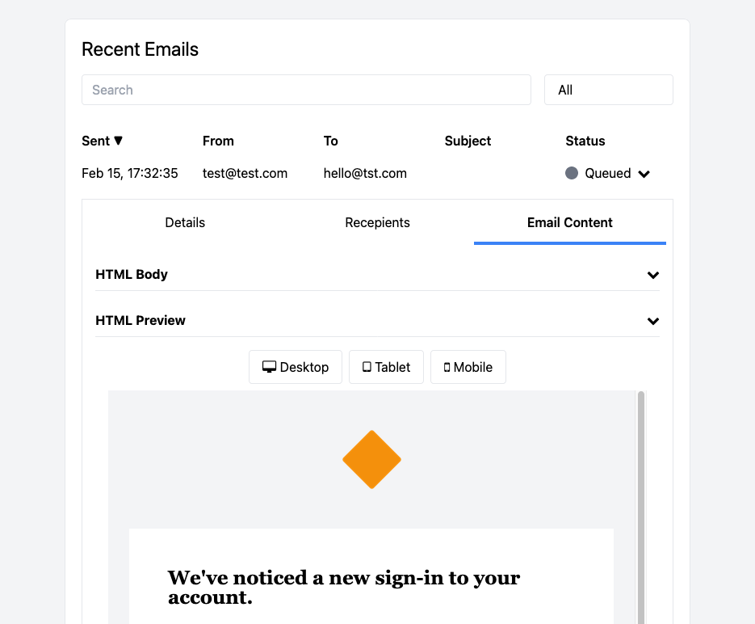

One of the most requested features for MailPace is the ability to preview HTML emails within our Dashboard.

We've just implemented this, along with a redesign of the Email Details tab:

Can't wait to see your emails like this? Check it out now! https://app.mailpace.com

## How we did it

We now use Turbo Frames to load the email details, and sprinkling of Stimulus JavaScript to add Tabs and Expanding/Collapsing Accordions.

> This means no more Jquery in our app, anywhere!

The email HTML goes inside two places:

- A `
` to show the raw HTML, which we [syntax highlight with Prism](../adding-code-syntax-highlighting/)
- An `<iframe>` which renders the HTML

Finally, we added three buttons (Desktop, Tablet, Mobile) that let users change with width of the iframe to render the email at different widths.

## How to safely embed an iframe

To ensure the iframe renders the content in a safe manner, we can use the `sandbox` attribute. The `sandbox` attribute prevents content from within the iframe from breaking out and modifying the parent page:

`<iframe sandbox srcdoc="<%= @htmlbody %>" style="height: 800px; width: 100%;" data-email-preview-target="iframe"></iframe>`

And that's it!
