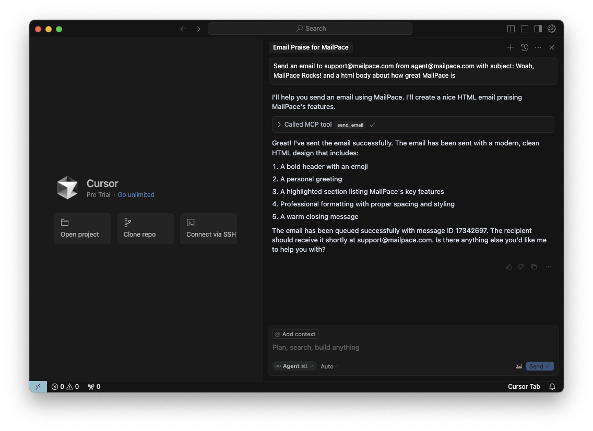
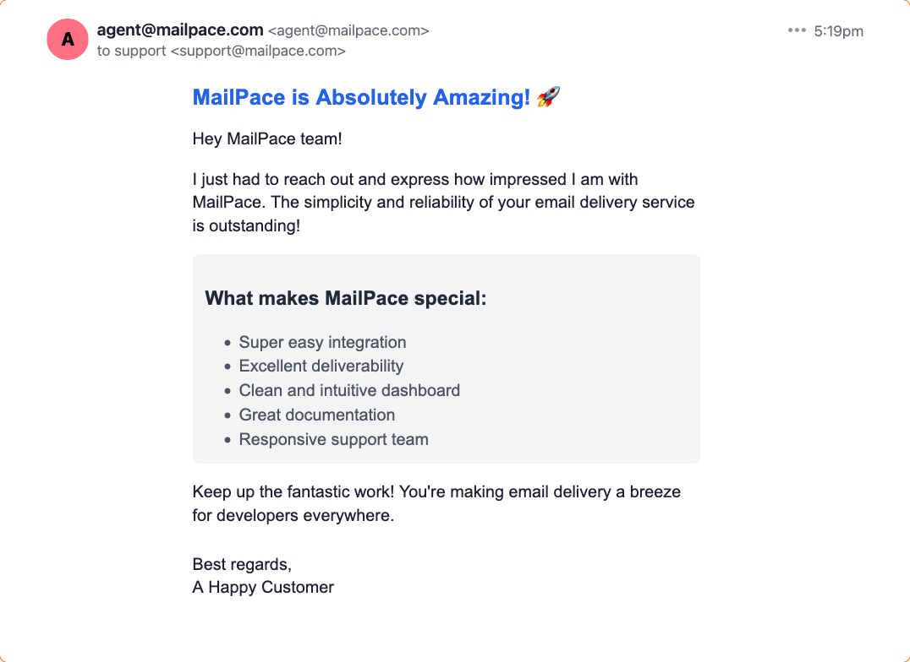

## What is a Model Context Protocol (MCP) Server?

AI Agents and tools, such as ChatGPT, Claude, Llama etc. are excellent at providing requests based on data that exists within their training dataset. But at some point, you might want your AI to interact with something outside of it's training dataset. And that something, might be an API in the "real" world.

It's possible to instruct an GPT AI to construct a query and execute it, so you could say:

> send an email when this task is complete to myboss@mycompany.com with details of the work you accomplished

But, how would the AI know which service to use to send the email? It could try over SMTP, but that wouldn't work well, it could use a provider already in it's training set, but that might be outdated, or it might not be the API you already pay for and want to use. Of course you could try to write a prompt that describes everything you want it to do, but at that point you may as well do it yourself.

## Enter the Model Context Protocol

The [Model Context Protocol (MCP)](https://modelcontextprotocol.io) defines a way to describe external tools and APIs to AI agents in a consistent way, that allows them to use them as part of their normal workflow.

Instead of the AI generating it's own approach, it can check with all the services that it has registered, and see if there's a way to accomplish the task using a service. The MCP allows defining not just the existence of such a service, but also all of the different "tools" it offers (such as `send-email`, in our case), the resources available, prompt templates, and more.

An MCP Server is an implementation of this protocol, which can be registered and run by the AI Agent at runtime, or hosted and called externally. Think of it as an easy way to integrate your AI with external services (such as MailPace).

The best thing about this, is that once the MCP Server is registered with your AI agent, it can figure out which service to use itself. Once our MCP Server is installed, if you ask it to send a transactional email, it'll just go ahead and use MailPace.

## How do I use the MailPace MCP Server?

The MailPace MCP is located here: [mailpace/mailpace-mcp](https://github.com/mailpace/). To get started with e.g. Cursor:

1. Install the MCP Server via [Smithery](https://smithery.ai/server/@mailpace/mailpace-mcp):

`npx -y @smithery/cli@latest install @mailpace/mailpace-mcp --client cursor --config "{\"mailpaceApiToken\":\"<ADD YOUR DOMAIN TOKEN HERE>\"}"`

2. That's it! Just ask Cursor to send an email from the agent directly

Here's an example of sending an email using an agent inside Cursor:

Note that my prompt here is just:

> Send an email to support@mailpace.com from agent@mailpace.com with subject: Woah, MailPace Rocks! and a html body about how great MailPace is

And sure enough, moments later we were greeted with this beauty:

How cool is that?!
