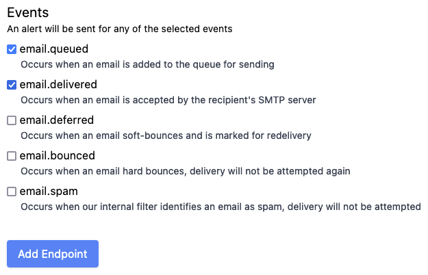
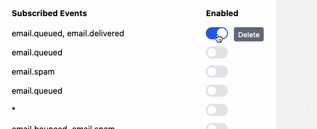

If you're creating a form the standard format for a boolean (true or false, on or off) field is to use a checkbox.

This works well, if you're filling in a form and clicking submit at the bottom, like when we create a new webhook in MailPace:



But **what if you don't have a submit button?** What if you let users make an On/Off change in line with your content? Then you need a solution that allows the user to make the change, and simultaneously show the state of the change in one place.

We use this in our email webhooks, which are triggered when an email changes state in the MailPace system. The toggle is used to enable or disable them, and they look like this:



# How?

In Rails with [Tailwind](https://tailwindcss.com/) it's easy. Just create a normal Rails form like this:

```html
<%= form_with model: model_name do |form| %> ... <% end %>
```

And inside it add an `inline-flex` label:

```html
<%= form_with model: model_name, class: "inline" do |form| %>
<label class="relative inline-flex items-center cursor-pointer"> ... </label>
<% end %>
```

Inside that we put our check box, but hide it with `sr-only`

```html
<%= form_with model: model_name, class: "inline" do |form| %>
<label class="relative inline-flex items-center cursor-pointer">
  <%= form.check_box :enabled, checked: endpoint.enabled, class: "sr-only peer" %>
</label>
<% end %>
```

Then lets put the actual Toggle in:

```html
<%= form_with model: model_name, class: "inline" do |form| %>
<label class="relative inline-flex items-center cursor-pointer">
  <%= form.check_box :enabled, checked: endpoint.enabled, class: "sr-only peer" %>
  <div
    class="w-11 h-6 bg-gray-200 peer-focus:outline-none peer-focus:ring-blue-300 dark:peer-focus:ring-blue-800 rounded-full peer dark:bg-gray-700 peer-checked:after:translate-x-full peer-checked:after:border-white after:content-[''] after:absolute after:top-[2px] after:left-[2px] after:bg-white after:border-gray-300 after:border after:rounded-full after:h-5 after:w-5 after:transition-all dark:border-gray-600 peer-checked:bg-blue-600"
  ></div>
</label>
<% end %>
```

Finally, let's add an `onChange` handler to the checkbox to submit the form when it changes state:

```html
<%= form_with model: model_name, class: "inline" do |form| %>
<label class="relative inline-flex items-center cursor-pointer">
  <%= form.check_box :enabled, checked: endpoint.enabled, class: "sr-only peer", onchange: "this.form.requestSubmit();"
  %>
  <div
    class="w-11 h-6 bg-gray-200 peer-focus:outline-none peer-focus:ring-blue-300 dark:peer-focus:ring-blue-800 rounded-full peer dark:bg-gray-700 peer-checked:after:translate-x-full peer-checked:after:border-white after:content-[''] after:absolute after:top-[2px] after:left-[2px] after:bg-white after:border-gray-300 after:border after:rounded-full after:h-5 after:w-5 after:transition-all dark:border-gray-600 peer-checked:bg-blue-600"
  ></div>
</label>
<% end %>
```

On the server side, just handle this like a normal form. Ideally using [Turbo](https://turbo.hotwired.dev/) to avoid full page reloads, and a nice toast or flash notification so the user knows it's changed something immediately.

# Why don't browsers support this natively?

I have no idea. If anyone wants to make it happen, please do!

# Got more questions, comments or feedback?

Contact us (by email of course): support@mailpace.com
