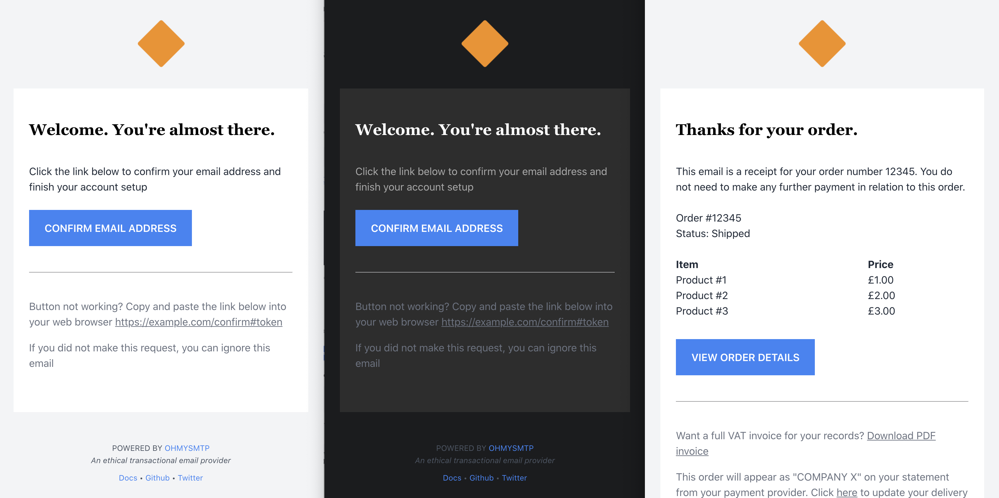

## We're releasing a set of Free Transactional Email templates

We want to make life easier for developers, so today we're releasing a free set of Transactional Email Templates (MIT Licensed)

Here's a quick preview:

Check out the source code / setup instructions here:

[https://github.com/mailpace/templates/](https://github.com/mailpace/templates/)

## Technical Details

The templates are built using [Maizzle](https://maizzle.com/) and [Tailwind CSS](https://tailwindcss.com/).

Maizzle is a really cool post-processor that allows you to use TailwindCSS to create emails. All styles are inlined and a bunch of best practices are followed to make it super easy to create high quality, good looking emails.

Tailwind gives you utility-based CSS classes, which is a really neat way to build interfaces. We use Tailwind extensively across all of our apps and landing pages.

It's very easy to enhance and build out on top of these templates (and they're MIT licensed), so feel free to `git clone` and start modifying them.

## Want to help us out?

If you like our templates or you're using them (or planning to use them), be sure to:

a) Star the project on github

b) Share the templates far and wide

c) Contribute more templates back to the library
