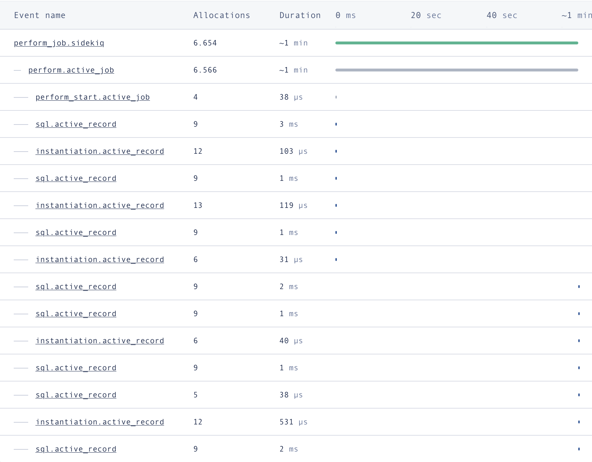

> TLDR: a DNS change slowed down connections to one of our services, resulting in about 7% of emails seeing delivery rates of between 30 and 60 seconds for 16 hours.

# What fast means

At MailPace we’re all about fast delivery of transactional emails. Typically this means under 10 seconds for all emails, and we start sending internal alerts when the average is over 5 seconds, as it usually means something is up, either with us or another provider.

We measure the full end to end delivery (by sending emails to the three big providers and literally checking the inbox over IMAP), and we publish the results live on our [landing page](https://mailpace.com). So it’s really important to us to keep an eye on this and ensure it’s running well.

# What happened

On Tuesday 8th Feb, at around 8pm GMT we noticed a sudden spike in the average time to inbox, and transaction averages of our email sending service. The spike jumped up, then back down to after 5 minutes, then every 10-15 minutes it came back up again. We hadn’t made any changes to production or our infra, so after a quick check that everything looked good on all our services, we assumed this was a temporary problem with another service and decided to monitor the problem overnight.

Of course, in the morning, the alerts had still not subsided, and we were seeing elevated rates for about 12 hours. Approximately 7% of emails were affected, and of those around 30% were seeing 1 minute long deliveries. The other 93% were sailing through just fine, and every ad-hoc test we ran arrived immediately.

# Attempts to solve

For several hours we checked everything. Logs, metrics, code, database indexes, and more. We ran performance testing locally on a large dataset, ran some tests on our production environment, and still couldn't find the reason why some were slow. The event timeline for the worst case affected jobs looked like this:



Note the extra long gap (1 min!) between `instantiation.active_record` and `sql.active_record`. Although it's not obvious here, looking at the code, this is where we call another service that actually sends the email.

This service does a couple of things, it takes the email, retrieves the latest DKIM key from another internal service, signs the email, then connects to the receiving SMTP server to send the email. It's understandable that this step can take a couple of seconds if the other SMTP server is being a bit slow, or there's a network issue, although it's usually under 500ms end to end.

# So why was this taking so long for a seemingly random selection of emails?

We were stumped, everything seemed to be in order wherever we looked. We even spotted a SQL query that wasn't fully optimized, and fixed that just to be sure, but as expected saw only a few ms improvement. So we asked ourselves **if this is random, where do we introduce randomness**?

Of course, we randomly select the mailing service we use to send the email. That code looks like this:

```ruby
  # Select the mailer address based on percentage distribution per mailer
  def select_mailer
    mailers = [
      [mta_address_one, 0.1],
      [mta_address_two, 0.2],
      [mta_address_three, 0.3],
      ...,
      ...
    ]

    mailers.max_by { |_, weight| rand**1.fdiv(weight) }[0]
  end
```

So we quickly checked and all affected emails were going through one endpoint. But there was nothing we could see wrong with that endpoint, and not all emails going through that endpoint were affected (around two thirds).

# Bingo, DNS!

Well it just so happens that on Tuesday afternoon, just before the issue, we were reviewing our IP addresses FCrDNS configuration, the beautifully named Forward-Confirmed reverse DNS.

This is a method used to validate the domain name of an IP address, ensuring that it matches the reverse DNS (rDNS) entry for that IP address. The idea behind FCrDNS is that if both forward and reverse DNS lookups match, it is highly likely that the IP address actually belongs to the domain in question. Email systems use this to reduce spam, by verifying that the FCrDNS of the sender's IP address matches the domain name in the "From" field of the email.

Two of our IP addresses were failing FCrDNS, that is, one of our sending domains was not pointing back to the two IP addresses. We added two additional A records to fix this.

**We now had three A records for this endpoint, pointing from domain -> IP address.**

These are only used for FCrDNS, so shouldn't make a difference to sending emails. At least, that's what we thought.

We made the change, checked emails were still going through as expected and switched over to other tasks.

However, what we didn't know at the time was, our list of IP addresses we were comparing was not the list of sending addresses, but included two IP addresses that we previously used for sending but now use for other activities. **The new A records pointed to IP addresses that weren't listening to anything we sent through**.

# What this meant

Every time an endpoint was selected at random, if it landed on the affected endpoint, our sending service would try to contact that endpoint. It first checks the DNS A records, and attempts a connection to the first one it retrieves back, if that fails, it tries the next one. The default timeout for this kind of connection is 30 seconds.

We completely forgot that our own internal service uses these DNS records to find the endpoint.

At this point 2 of the 3 IPs listed in our DNS record had nothing on the other end. For one third of affected emails, the connection would happen straight away with no issues, for the next set it would connect on the second try (after 30 seconds) and for the final third it take a whole minute(!) to find the right endpoint.

Once we realised what was happening, we rolled back the the DNS changes and immediately speeds went back to normal.

# What we learnt

DNS changes are risky and almost impossible to test. Even an innocuous change can have downstream impacts.

Distributed systems are hard to manage.

We trust our own judgement too much, and have little faith in past decisions. We "knew" our IP was misconfigured, and we "knew" the DNS changes couldn't affect sending. But we were wrong on both counts, causing the initial issue and slowing down our fix.

# How we're avoiding this in the future

We're adding more instrumentation and monitoring to pinpoint these issues more quickly. And of course we'll be extra careful when touching DNS records.
